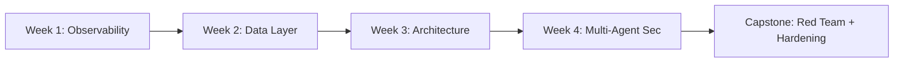

# Agentic AI Security Demos — Bootcamp Labs

[]()
[](https://www.python.org/)
[](LICENSE)
[]()
[]()

> **Hands-on, research-driven training** for analysing, attacking, and securing autonomous AI systems — multi-agent observability, prompt injection, LPCI, adversarial evaluation, and red-teaming exercises. All labs run **offline with synthetic fixtures only**.



Homework for Week 1, 2, 3, and 4:

Week 1: 

# agentic-ai-observability-lab-
agentic-ai-observability-lab/ │ ├── README.md ├── requirements.txt ├── app.py │ ├── src/ │   ├── agent.py │   ├── retrieval.py │   ├── memory.py │   ├── observability.py │   ├── evaluation.py │ ├── notebooks/ │   └── agentic_observability_lab.ipynb │ └── data/     └── adversarial_prompts.json


# Agentic AI Observability & Adversarial Evaluation Lab

Advanced browser-based labs for analysing:

- Multi-agent observability
- Prompt injection
- Logic-layer prompt control injection (LPCI)
- Adversarial evaluation harnesses

## Quick Start (Local)

```bash
pip install -r requirements.txt
streamlit run app.py

# Week 2 — Securing AI from the Data Layer Up (Homework)

This folder contains four tasks aligned to Week 2 of the Agentic AI Security Bootcamp:
1. **Task 1 — Attack Surface Mapping & Threat Model** (deliverable: `attack_surface-threatmodel.md`)
2. **Task 2 — Data Poisoning Simulation** (deliverable: `poisoning_simulation.py`, outputs: `poisoned_stream.jsonl`)
3. **Task 3 — Red Team: Orchestration & API Fuzzing** (deliverable: `dag_hijack_demo/` scripts and `redteam_report.md`)
4. **Task 4 — Hardening & Governance Implementation** (deliverable: `hardening_playbook.md` and a short demo notebook `hardening_demo.py`)

Requirements:
- Work in a fork or branch. Provide a short technical write-up for each task (200–500 words) and the code artifacts.
- Use the package dependencies listed in the repo `requirements.txt`. Tests should be runnable locally.
- Cite any external tools, datasets, or third-party packages used.

Submission:
- Create a PR to the course repo with a single top-level folder `homework/week-02-data-layer/<github-username>/`.
- Include `redteam_report.md` summarising findings, mitigations, and suggested next steps.

Reference: Week 2 syllabus and learning outcomes.  [oai_citation:2‡oreilly.com](https://www.oreilly.com/live-events/agentic-ai-security-bootcamp/0642572236106/)
